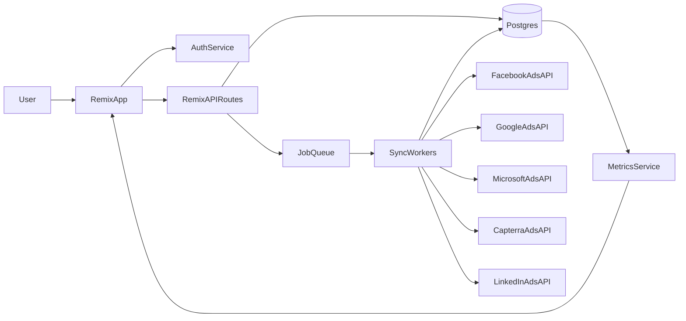

### Goal

Build a **multi-tenant Remix app** that connects to **Facebook Ads, Google Ads, Microsoft Ads, Capterra Ads, and LinkedIn Campaigns**, aggregates campaign performance hourly, and provides **cross-channel overviews, comparisons, and spend recommendations**.

---

### High-level architecture

- **Frontend (Remix app)**
  - **Tech**: Remix (React), TypeScript, Tailwind or equivalent utility CSS.
  - **Key responsibilities**:
    - OAuth flows or API-key onboarding for each ad platform.
    - Multi-tenant navigation (workspace/account switcher, client selection if agency).
    - Dashboards: unified KPIs, cross-network comparison, ranking charts.
    - Budget recommendation views with clear justifications and confidence hints.
- **Backend (Remix server + background workers)**
  - **Remix loaders/actions** for authenticated app routes.
  - **Background jobs** (e.g. with `node-cron`, a queue, or external worker like Temporal/Cloud Tasks):
    - Hourly data pulls from each connected ad platform per account.
    - Normalization and storage into a unified schema.
    - Precomputation of aggregates and recommendations.
- **Database & storage**
  - Relational DB (e.g. Postgres) for:
    - Tenants, users, roles, workspaces.
    - Connected ad accounts and credentials.
    - Normalized metrics (campaign, ad set/group, ad level).
    - Aggregated fact tables (daily/hourly metrics per campaign & platform).
  - Optional object storage later for exports/snapshots.
- **External integrations**
  - Facebook Marketing API.
  - Google Ads API.
  - Microsoft Advertising API.
  - Capterra Ads reporting API (or CSV ingestion if APIs are limited).
  - LinkedIn Marketing Developer Platform.

---

### Data model (core entities)

- **Tenant & user model**
  - `Tenant`: organization/workspace; supports agency-style multi-tenancy.
  - `User`: belongs to one or more tenants; basic roles (admin, analyst, viewer).
  - `TenantMembership`: join table for user↔tenant with role.
- **Ad accounts & connections**
  - `AdPlatform`: enum-like (Facebook, Google, Microsoft, Capterra, LinkedIn).
  - `AdAccountConnection`:
    - Tenant-level credential store: token fields, refresh token, expiry, scope.
    - External account identifiers (ad account ID, name, timezone, currency).
    - Status flags (active, errored, needs_reauth).
- **Campaign & metrics schema** (normalized cross-platform)
  - `Campaign`:
    - `platform`, `platform_campaign_id`, `name`, `status`, `tenant_id`, `ad_account_connection_id`.
  - `CampaignMetricSnapshot` (fact table):
    - Foreign key to `campaign`.
    - `date` + optional `hour` field for hourly sync granularity.
    - Unified measures: `impressions`, `clicks`, `spend`, `conversions`, `revenue`, `ctr`, `cpc`, `cpm`, `cpa`, `roas`.
    - Raw JSON for platform-specific extras if needed.
  - Optional lower-level tables for ad groups and ads later.

---

### Normalization & metrics strategy

- **Unified metric layer**
  - Map each platform’s native metrics to a unified schema (e.g. `cost_micros` → `spend`, `conversions_value` → `revenue`).
  - Convert spend and revenue to a **base currency** (e.g. EUR or USD) using stored or external FX rates.
  - Normalize time to UTC internally; show in tenant’s preferred timezone.
- **Precomputed aggregates**
  - Create views or materialized tables for:
    - `daily_campaign_performance` (sums per tenant, platform, campaign).
    - `platform_summary` (per-tenant aggregated KPIs per platform).
    - `top_campaigns_by_metric` (e.g. best ROAS, lowest CPA) to power ranking UI.

---

### Integrations & data sync (hourly)

- **General sync flow per platform**
  1. For each active `AdAccountConnection`, enqueue a job for each configured platform.
  2. Worker executes:
    - Refresh auth tokens if needed (OAuth refresh flow).
    - Pull data for the **last N hours/days** (e.g. lookback window of 2–3 days to catch post-attribution corrections).
    - Map external fields to normalized schema.
    - Upsert `Campaign` and `CampaignMetricSnapshot` rows.
  3. Mark connection health (success, partial failure, rate limit backoff, errors).
- **Platform-specific considerations**
  - **Facebook Ads**: Marketing API; pull insights at campaign level with breakdown by date/hour.
  - **Google Ads**: Google Ads Query Language (GAQL) for campaigns; respect quotas with batching.
  - **Microsoft Advertising**: Reporting API; might be more batch/async; store report job IDs.
  - **Capterra Ads**: Check API; if limited, design CSV upload or manual import as interim.
  - **LinkedIn Campaigns**: Marketing APIs for campaign insights; handle smaller quotas and stricter limits.
- **Error handling & retries**
  - Exponential backoff per connection when rate-limited.
  - Log error events in `SyncLog` table with job ID and root cause.
  - Simple alert surface in UI (e.g. “LinkedIn sync failed, click to retry”).

---

### Core user flows & UX

- **Onboarding & multi-tenancy**
  - Sign up / login (basic email+password or SSO later).
  - Create/select `Tenant` and workspace (for agencies: one tenant per agency, then nested client accounts inside via ad connections).
  - Step-by-step wizard to connect ad platforms:
    - Choose platform.
    - OAuth / API key input.
    - Select which ad accounts to link to the tenant.
- **Home dashboard (cross-channel overview)**
  - Header: date range selector (e.g. Today, Last 7 days, Last 30 days, Custom).
  - KPI summary cards for **All platforms combined**:
    - Total spend, total conversions, total revenue, overall ROAS, blended CPA.
  - Stacked or grouped bar chart showing **spend vs conversions/revenue per platform**.
  - Table of **platform performance comparison**:
    - Per platform: spend, conversions, revenue, ROAS, CPA, CTR.
    - Sortable, with color coding for good/bad performance.
- **Campaign explorer**
  - Filter bar: platform, account, status, campaign name search, min impressions/spend.
  - Data table:
    - Each row is a campaign, with metrics for the selected date range.
    - Columns for spend, conversions, revenue, ROAS, CPA, CTR, status.
    - Column to show a sparkline of performance or trend.
  - Detail drawer or page per campaign with time-series chart.
- **Best/underperforming campaigns view**
  - Ranking cards:
    - “Top campaigns by ROAS” (top N across all platforms).
    - “Highest spend with low ROAS” (candidates for budget reduction).
  - Visual cues (e.g. red for underperformers, green for top performers).

---

### Budget insights & recommendations (initial version)

- **Scoring model (simple rules-based for v1)**
  - Compute per-campaign metrics for given date range:
    - `roas`, `cpa`, `conversion_rate`, `spend`, `impression_volume`.
  - Define thresholds per tenant (configurable defaults), e.g.:
    - `good_roas_threshold`, `bad_roas_threshold`, `min_spend_threshold`.
  - Use rules like:
    - If `spend` is high and `roas` < `bad_roas_threshold` → candidate to **decrease budget**.
    - If `roas` is high and `spend` < `min_spend_threshold` → candidate to **increase budget**.
- **Recommendation surface**
  - Recommendations list with:
    - Campaign, platform, current daily spend.
    - Suggested action: “Increase budget by 20%” or “Cut budget by 30%”, or “Pause campaign”.
    - Short rationale (e.g. "ROAS 4.1 vs target 2.0, spend below threshold").
  - Initially, **read-only** (no auto-changes in external platforms); later add automation.

---

### Security, auth, and permissions

- **Authentication**
  - Session-based auth in Remix (`@remix-run/node` sessions or a library like `remix-auth`).
  - Password hashing with a robust library (e.g. `bcrypt`).
- **Authorization**
  - Tenant scoping middleware for loaders/actions (ensure queries are filtered by `tenant_id`).
  - Role checks for sensitive actions (e.g. only tenant admins can manage integrations).
- **Secret & token management**
  - Encrypted storage for refresh tokens and API keys.
  - Environment-variable-based configuration for API credentials and callbacks.

---

### Deployment & DevOps

- **Environments**
  - `development`, `staging`, `production` Remix builds.
- **Hosting options**
  - Remix on a Node host (e.g. Fly.io, Render, Railway, or a custom Node server with Postgres).
  - Scheduled jobs:
    - Use platform-native cron (e.g. Render cron, GitHub Actions hitting an internal endpoint, or dedicated worker dyno with `node-cron`).
- **Observability**
  - Centralized logging for sync workers and Remix server.
  - Basic metrics: sync durations, errors, rate limit events, data volume.

---

### Phased implementation roadmap

- **Phase 0 – Project setup**
  - Initialize Remix app with TypeScript and Tailwind.
  - Set up Postgres schema migration tool (e.g. Prisma, Drizzle, or Kysely).
  - Implement basic auth, user, tenant, and membership models.
- **Phase 1 – Core data model & UI skeleton**
  - Implement DB tables for `AdAccountConnection`, `Campaign`, `CampaignMetricSnapshot`.
  - Create base layouts and navigation (tenant switcher, dashboard shell).
  - Stub API services for each platform with mock data.
- **Phase 2 – First integration end-to-end (Facebook or Google)**
  - Implement OAuth and connection management UI for chosen platform.
  - Implement worker/cron job for hourly sync of campaigns & metrics.
  - Fill dashboard and campaign explorer using live data from the first platform.
- **Phase 3 – Add additional platforms**
  - Repeat integration pattern for Microsoft, Capterra, LinkedIn.
  - Harden rate-limiting, error handling, and logging across all integrations.
- **Phase 4 – Analytics & recommendations**
  - Implement aggregate queries and views for multi-platform comparison.
  - Build visualizations: KPIs, comparison charts, ranking views.
  - Implement rules-based recommendation engine and surface budget suggestions.
- **Phase 5 – Hardening & UX polish**
  - Improve onboarding flows and empty states.
  - Add basic exports (CSV) and sharable views.
  - Add tests for core loaders/actions and data sync logic.

